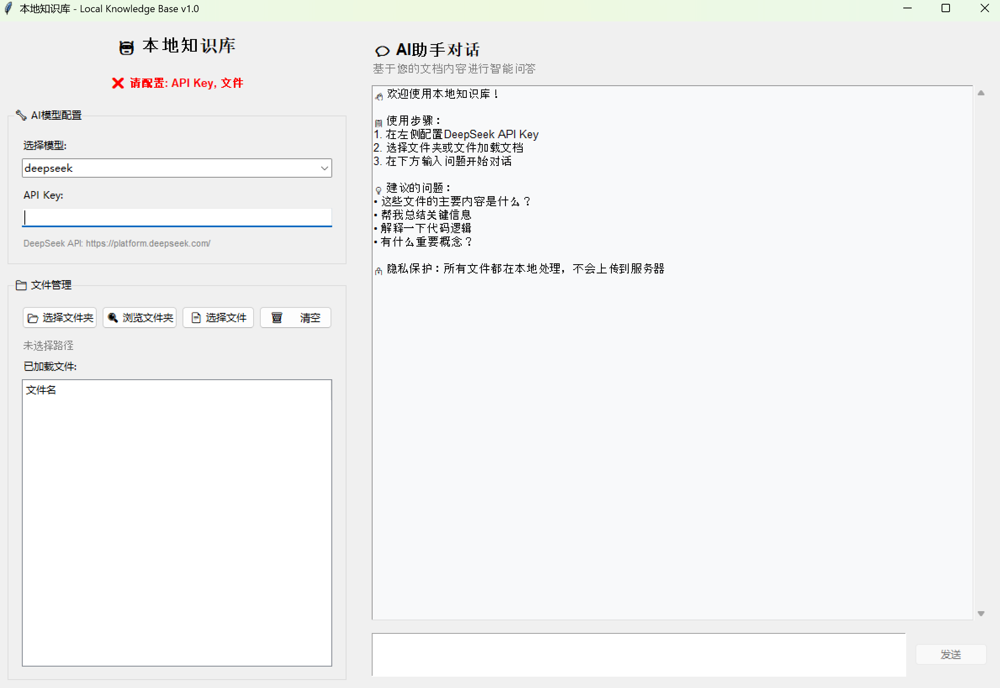
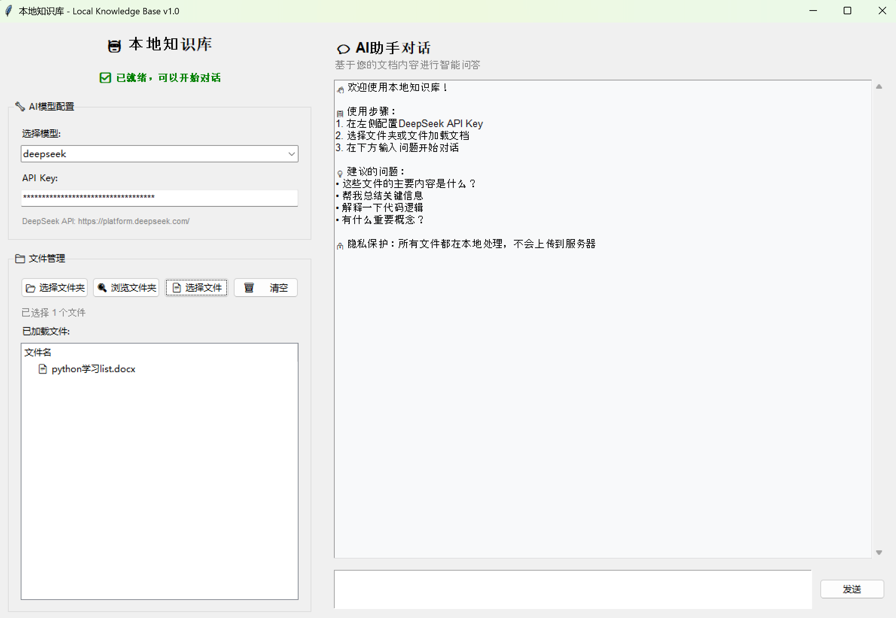
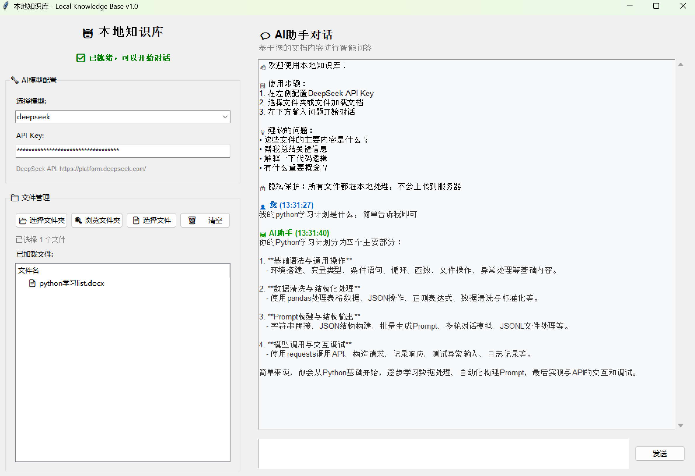

# 🚀 Local Knowledge Base - 本地知识库AI助手

> 一个基于DeepSeek AI的本地文档智能问答系统，保护隐私的同时享受AI服务

## 💡 创作初衷

项目灵感源于我配置本地知识库的实际体验。我之前想在Chatbox上配置MCP来关联本地知识库和AI模型对话，希望能快速了解文件内容。虽然跟着教程完成了配置，但整个过程涉及代码操作，还是花了不少时间。

这个经历让我思考：**如果普通用户想搭建本地知识库，这个过程会不会太复杂？**

某天早上6点醒来时，一个想法突然闪现：能不能把这个流程极大简化？做成软件包的形式，用户在自己电脑里上传文件，和模型对话就行，很傻瓜化，也不用懂代码或MCP配置，最多给个用户手册教怎么获取API Key。

心动不如行动！我立即和Claude Code开启协作，从早上聊到中午，完成了这个MVP。

现在开源分享给社区，因为我的代码能力有限，希望厉害的程序员们能在此基础上玩出更酷的东西。**这是我从想法到落地的一次有意义尝试！** 🎯

[](https://python.org)
[](LICENSE)
[]()

## ✨ 特性

🎯 **零门槛使用** - 无需配置MCP或编程知识，下载即用  
📁 **Word文档支持** - 专门针对Word文档(.doc, .docx)优化  
🤖 **智能问答** - 基于DeepSeek AI，理解文档内容并智能回答  
🔒 **隐私安全** - 文档完全本地处理，只有AI对话内容发送给API  
⚡ **快速响应** - 本地索引，秒级文档检索  
🆓 **完全免费** - 开源项目，仅需免费的DeepSeek API Key

## 📸 软件演示

### 界面展示

*配置界面：设置DeepSeek API Key*


*文档选择：支持Word文档格式*


*智能问答：基于DeepSeek AI理解Word文档内容并回答问题*

> 💡 **使用流程**: 配置DeepSeek API Key → 选择Word文档 → AI智能问答

## 🚀 快速开始

### 方式一：直接运行（推荐）

1. 下载 [最新发布版本](releases/v1.0/本地知识库.exe)
2. 双击运行 `本地知识库.exe`
3. 配置DeepSeek API Key
4. 选择文档文件夹开始使用

### 方式二：从源码运行

1. 克隆项目
```bash
git clone https://github.com/yourusername/local-knowledge-base.git
cd local-knowledge-base
```

2. 安装依赖
```bash
pip install -r requirements.txt
```

3. 运行程序
```bash
python src/local-knowledge-base.py
```

## 🔑 API Key 获取

1. 访问 [DeepSeek Platform](https://platform.deepseek.com/)
2. 注册并登录账户
3. 创建API Key
4. 在软件中配置使用

## 📁 支持的文件格式

- **Word文档**: `.doc`, `.docx`

> 🔧 **扩展计划**: 未来版本将支持更多格式（PDF、TXT、代码文件等），欢迎贡献代码！

## 🛠️ 构建说明

如果你想自己打包exe文件：

```bash
# 安装打包依赖
pip install pyinstaller

# Windows用户可直接运行
scripts/打包程序.bat

# 或者手动打包
pyinstaller build/build.spec
```

## 💡 使用技巧

- 📂 选择包含Word文档的文件夹进行批量分析
- 🎯 提问时越具体，DeepSeek AI回答越准确  
- 🔍 支持中英文Word文档和对话
- 💾 文档内容会被缓存，重复使用更快

## 🤝 贡献

欢迎提交 Issue 和 Pull Request！

1. Fork 这个项目
2. 创建你的特性分支 (`git checkout -b feature/AmazingFeature`)
3. 提交你的改动 (`git commit -m 'Add some AmazingFeature'`)
4. 推送到分支 (`git push origin feature/AmazingFeature`)
5. 打开一个 Pull Request

## 📄 许可证

本项目采用 MIT 许可证 - 查看 [LICENSE](LICENSE) 文件了解详情

## 🙏 致谢

- [DeepSeek](https://platform.deepseek.com/) - 提供强大的AI能力
- [Claude Code](https://claude.ai/code) - 开发过程中的AI编程助手
- [PyInstaller](https://pyinstaller.org/) - Python打包工具
- [tkinter](https://docs.python.org/3/library/tkinter.html) - GUI框架

**特别感谢** Claude Code 让从想法到产品的实现如此流畅，3小时完成MVP的背后是AI辅助开发的力量！

## 📞 联系方式

如果你觉得这个项目有用，请给个 ⭐ Star 支持一下！

有问题可以提 Issue 或联系开发者。

---

**🌟 如果这个项目对你有帮助，别忘了点个 Star！**